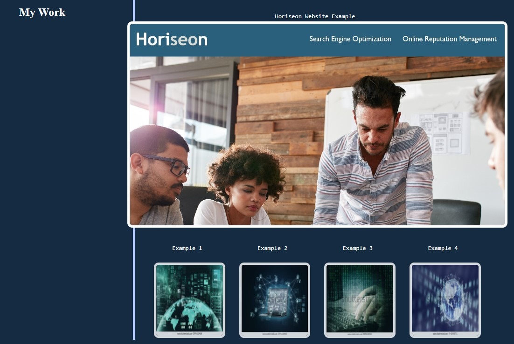

# Rickelle's Portfolio 

## Description

This project is my first step to a career path in Web Development, I created this space as a portfolio of my journey and progress. This portfolio isn't just to showcase for my final projects but to show the progress and also to continue to use it as a tool that will be used to reflect on and develop myself further. The target of this project is to remotely deliver samples of my work and share my journey through out my Bootcamp in Coding and my Career progression. I have started from near to none a experience and have exceeded my own expectations by completing this project in a fast paced environment and having a satisfactory end product. The biggest challenge for this project was learning the power and functionality of flexboxes, creating this has given me a wider understanding to CSS.

## Installation

N/A

## Usage

This project allows you to interact with most of the page and to maximise the users experience, starting with the ability to use the top header options; "About Me", "My Work" or "Contact Me" to navigate to the designated content on the page. This will create a smooth scroll there. Both the "My Work" and "Contact Me" section provide links to external resources & the "My Work" images highlight when hovered over for a better visual effect. 

The UI will adjust for better accessiblity and will adapt to the devices resolution, ensuring a better interaction with the webpage. 

Please see some of the examples provided:

To access the full deployed website please use link below:

https://ellekcir.github.io/portfolio/

## Credits

ADL Uni Bootcamp 

https://unsplash.com/s/photos/back-ground

## License

MIT License

Please see LICENSE for details

